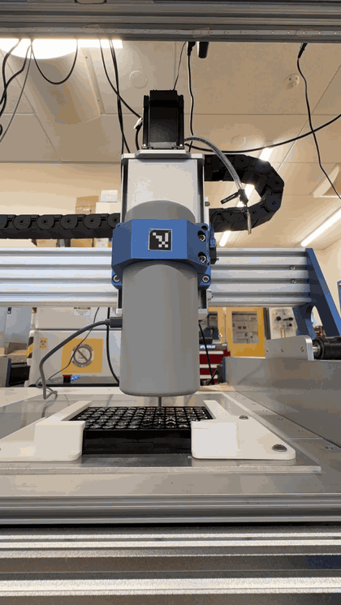
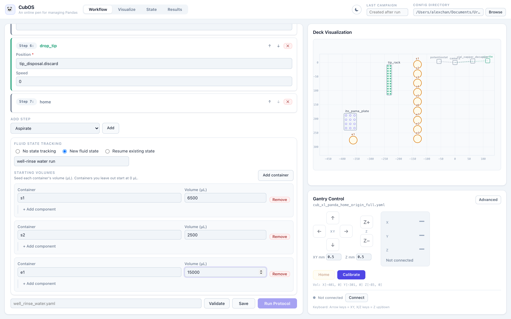

# CubOS

CubOS is a Python control layer for CNC-based lab automation. It connects
GRBL gantry motion, mounted instruments, deck labware, YAML protocols, offline
motion validation, and SQLite-backed experiment data into one operator and
developer workflow.

<p align="center">
  
</p>

Use CubOS to:

- define gantry, deck, and protocol state in versioned YAML files
- validate concrete motion targets before connecting to hardware
- run reproducible measurement and liquid-handling protocols
- persist experiment state and measurement data for later analysis
- extend the platform with new instruments, labware, and command handlers

The Operator web interface loads the same gantry, deck, and protocol YAML
configs, visualizes the deck, and drives calibration and protocol runs with
per-container fluid state tracking — shown here with the PANDA
liquid-handling platform's configs loaded and a seeded fluid state:



CubOS can move real lab hardware. Always validate configs offline, calibrate
the gantry work frame, keep an E-stop reachable, and start with minimal motion
before running scans, indentation, dispensing, or other instrument actions.

## Installation

See [Getting Started](docs/getting-started.md) for full, OS-specific
installation instructions (Windows/macOS/Linux prerequisites, venv setup,
instrument extras, serial port discovery). Docs are the source of truth for
installation steps — this README doesn't duplicate them.

## Quick Start

Validate an example setup without moving hardware:

```bash
pip install -e packages/core
python -m cubos.tools.validate_setup \
  packages/core/configs/gantry/cub_xl_asmi.yaml \
  packages/core/configs/deck/asmi_deck.yaml \
  packages/core/configs/protocol/asmi/move_a1.yaml
```

For real hardware, calibrate the gantry YAML before running protocols:

```bash
python -m cubos.tools.calibrate_gantry packages/core/configs/gantry/cub_xl_asmi.yaml
```

After calibration, confirm physical jog direction with the interactive test:

```bash
python -m cubos.tools.hello_world \
  --gantry packages/core/configs/gantry/cub_xl_asmi.yaml
```

Then run a minimal protocol:

```bash
python -m cubos.tools.run_protocol \
  packages/core/configs/gantry/cub_xl_asmi.yaml \
  packages/core/configs/deck/asmi_deck.yaml \
  packages/core/configs/protocol/asmi/move_a1.yaml
```

## How CubOS Is Organized

A runnable experiment is defined by three YAML files:

```text
packages/core/configs/
  gantry/     # machine envelope, serial port, homing, instruments
  deck/       # labware placement, holder nesting, calibration anchors
  protocol/   # ordered experiment steps
```

The runtime package is split by responsibility:

- `packages/core/src/cubos/gantry/` handles GRBL communication, coordinates, and machine geometry.
- `packages/core/src/cubos/deck/` loads labware definitions and resolves deck positions.
- `packages/core/src/cubos/protocol_engine/` validates and executes protocol commands.
- `packages/core/src/cubos/instruments/` contains instrument drivers, mocks, and registry metadata.
- `packages/core/src/cubos/data/` provides SQLite persistence and analysis helpers.
- `packages/core/src/cubos/tools/` contains operator-facing validation, calibration, and run tools.
- `services/api/` contains the sole FastAPI backend (`cubos_api`).
- `apps/operator-web/` contains the browser client for that API.
- `sdk/python/` contains the Python client and `cubos-send` CLI for `/api/v1`.
- `deploy/docker/` contains the production application image contract.
- `deploy/windows/` contains the Windows operator installer.

Both the operator web app and Python SDK call the same `/api/v1` FastAPI
surface. The API uses `cubos.gantry.session.GantrySession` as the sole persistent
hardware owner. The session owns serial locking, cached
position/status, manual movement guards, calibration soft-limit state, protocol
execution against the connected gantry, campaign creation, and run persistence.

For configuration details, command semantics, and operator procedures, use the
full documentation instead of treating this README as the source of truth.

## Documentation

- [Getting Started](docs/getting-started.md)
- [Configuration](docs/configuration.md)
- [Calibration](docs/calibration.md)
- [Gantry](docs/gantry.md)
- [Deck](docs/deck.md)
- [Run a Protocol with YAML](docs/protocol-yaml.md)
- [Python Protocols](docs/protocol-python.md)
- [Data](docs/data.md)
- [Gantry Bring-Up](docs/admin/gantry-bring-up.md)
- [Troubleshooting & Recovery](docs/troubleshooting.md)
- [API Reference](docs/reference/index.md)

Build and serve the documentation locally:

```bash
pip install -e "packages/core[docs]"
mkdocs serve
```

## Development

Install developer dependencies and run the test suite:

```bash
pip install -e "packages/core[dev,docs]"
python -m pytest packages/core/tests -q
```

Install and validate the server and web workspace:

```bash
pip install -e packages/core
pip install -e "services/api[dev]"
python -m pytest services/api/tests -q
python -m pytest sdk/python/tests -q
cd apps/operator-web
npm ci
npm run lint
npm run test -- --run
npm run build
```

For hardware-adjacent changes, also run focused setup validation for the
affected gantry, deck, and protocol combination:

```bash
python -m cubos.tools.validate_setup \
  packages/core/configs/gantry/cub_xl_asmi.yaml \
  packages/core/configs/deck/asmi_deck.yaml \
  packages/core/configs/protocol/asmi/indentation.yaml
```

Run `mkdocs build --strict` before publishing documentation changes.
