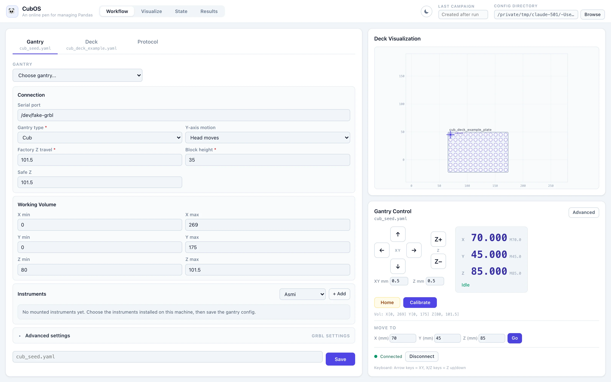
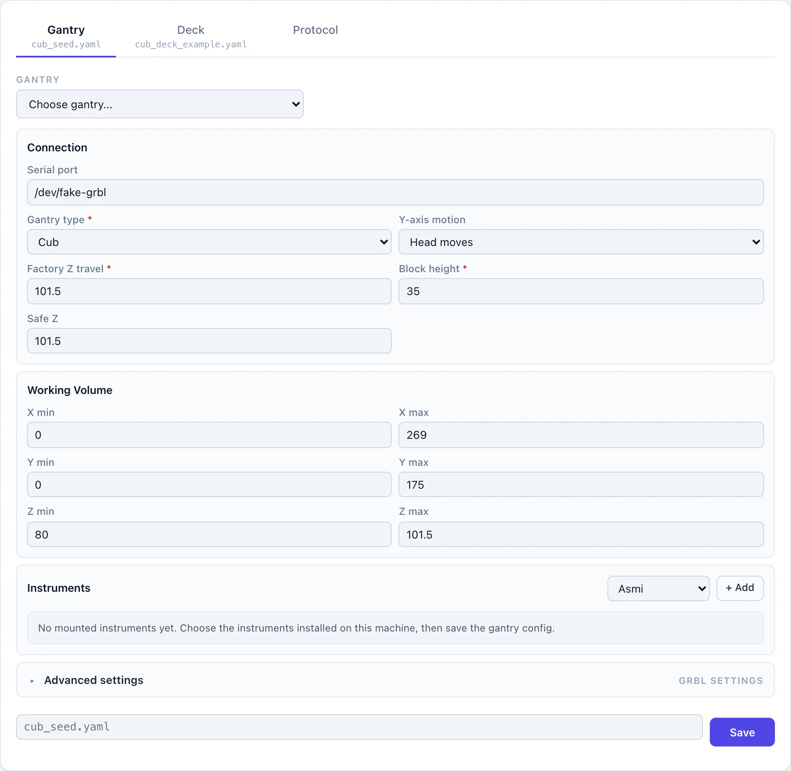
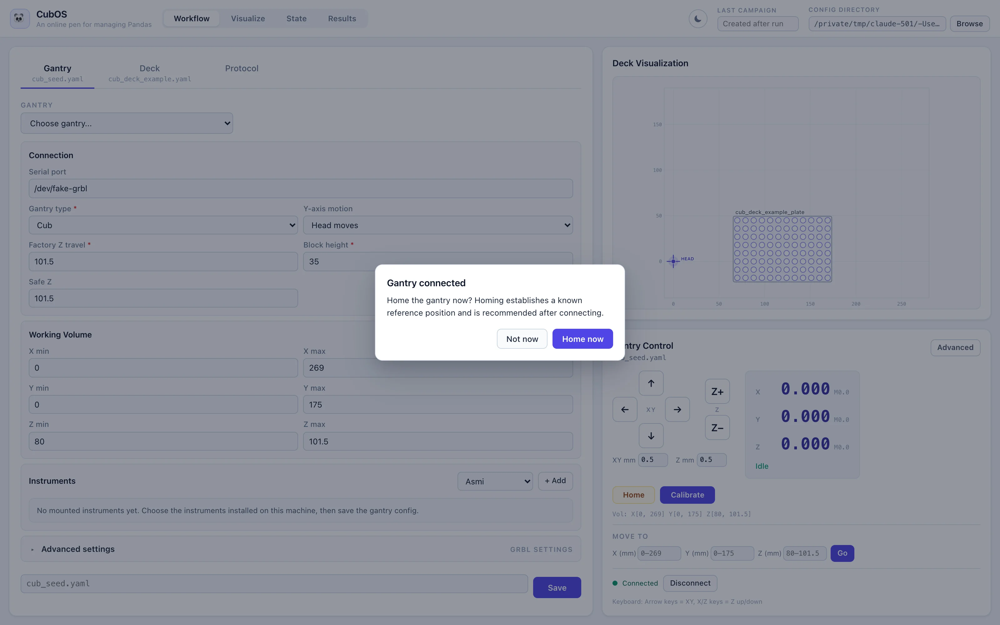
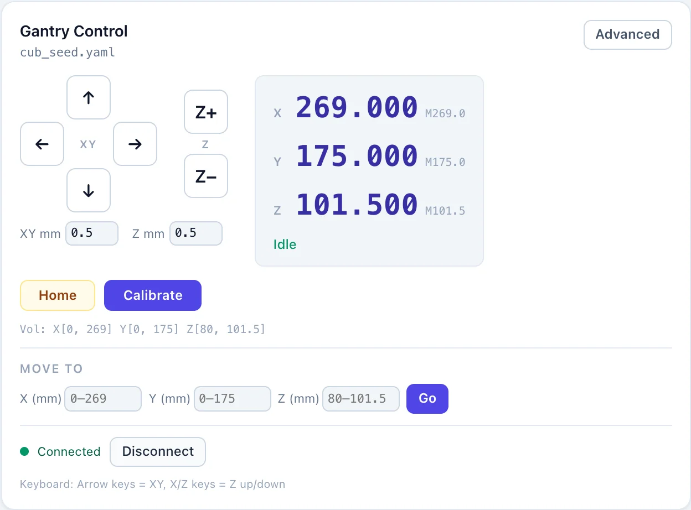
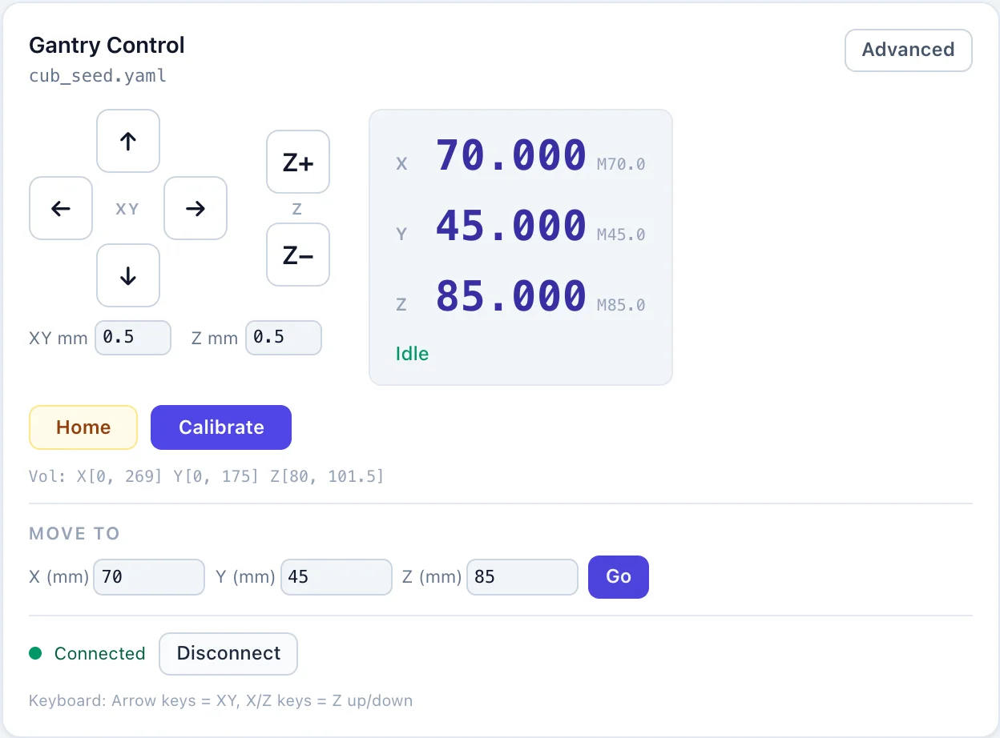
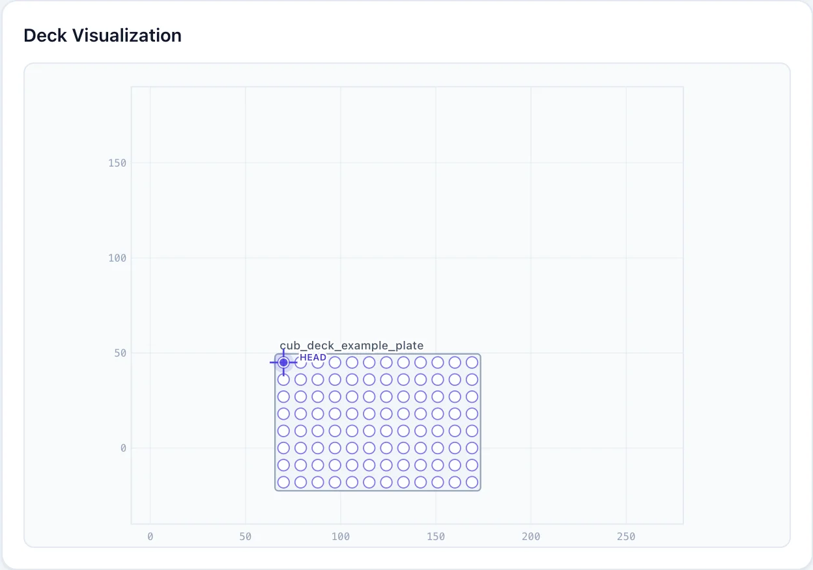
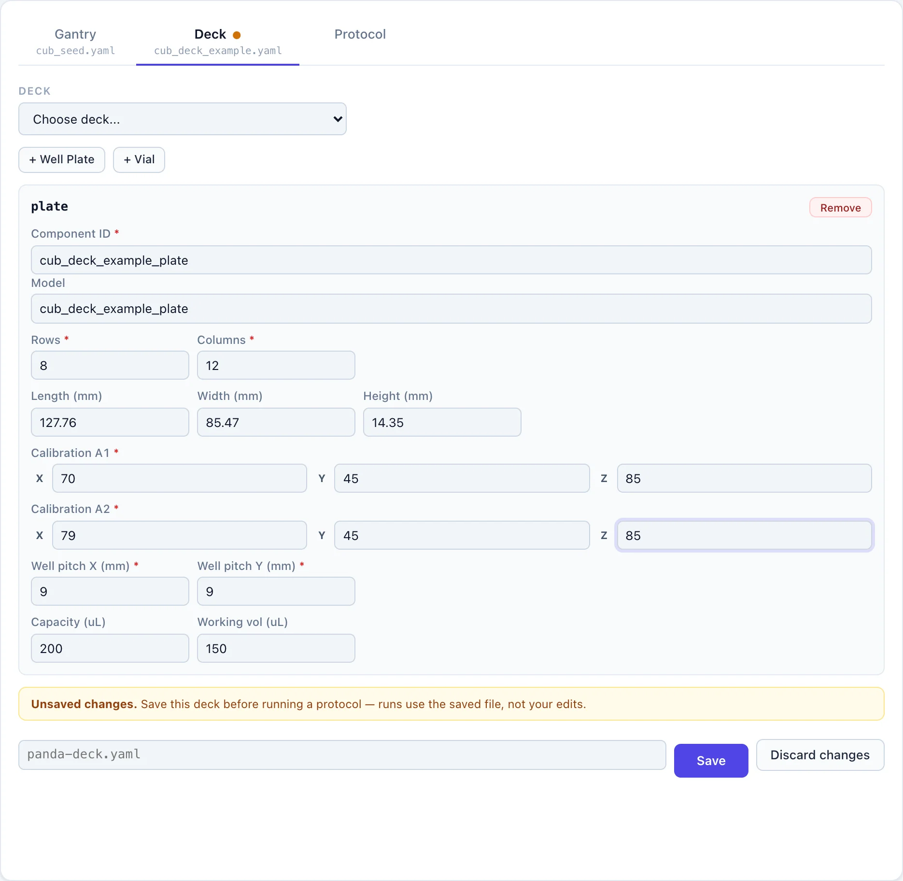
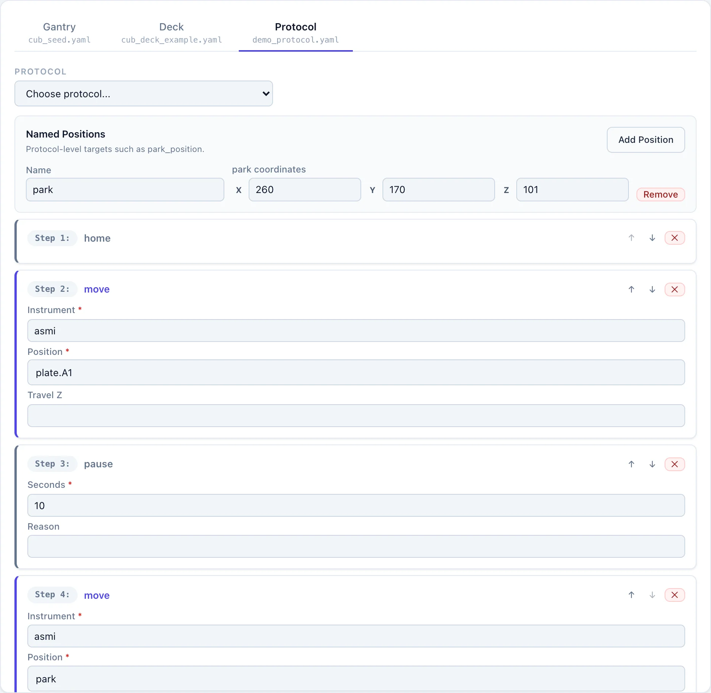
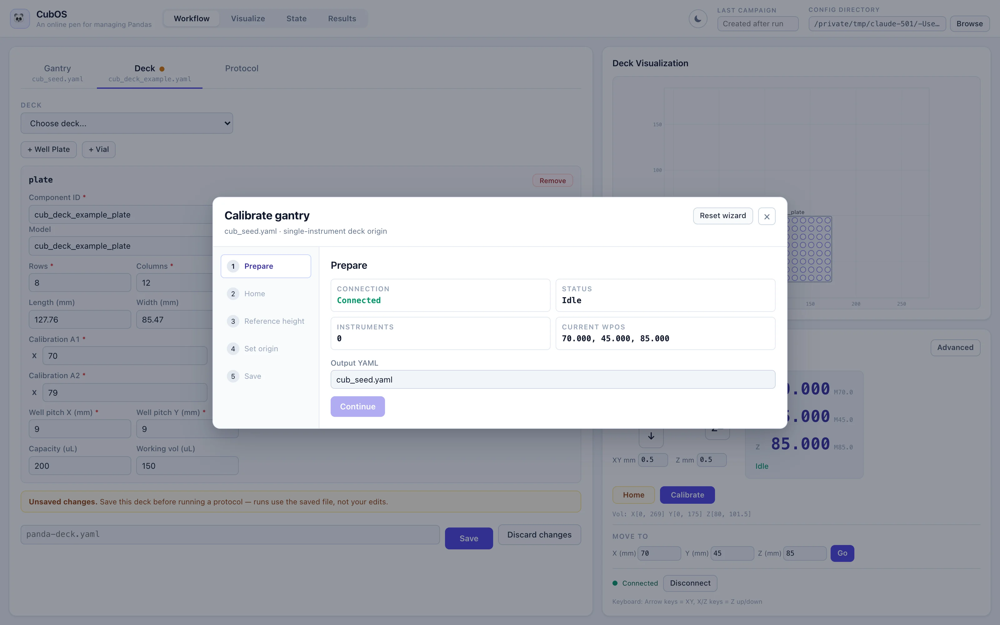

# Use the Operator UI

The Operator UI is CubOS's browser app. It lets you connect to the gantry,
move it with on-screen buttons, define where your labware sits on the deck,
and run protocols — all without touching a terminal or editing YAML by hand.

Everything in this guide happens in a normal web browser. If you can fill in
a web form, you can drive CubOS.



## Start the Operator UI

If you are using a preinstalled CubOS appliance, the Operator UI is already
running — open a browser on the lab computer and go to the address your
administrator gave you (by default it is `http://127.0.0.1:8742` on the
machine itself).

To start it yourself on the computer connected to the gantry:

!!! note "Prerequisite"
    The UI server is a separate package from the CubOS core. If you haven't
    yet, install it into the same virtual environment (from the repository
    root, with the venv activated):

    ```bash
    python -m pip install -e services/api
    ```

    Otherwise `python -m cubos_api` fails with `No module named cubos_api`.
    It requires Python 3.11+.

!!! note "Prerequisite: build the web app once"
    The browser interface is compiled from `apps/operator-web/`. If the
    server starts but logs `compiled web assets were not found` and the
    browser shows **404 Not Found**, install
    [Node.js 20 LTS or newer](https://nodejs.org) and build it (from the
    repository root):

    ```bash
    cd apps/operator-web
    npm ci
    npm run build
    cd ../..
    ```

    Then start `python -m cubos_api` again — it only picks up the compiled
    assets at startup. See
    [Build the Operator UI](getting-started.md#build-the-operator-ui-browser-app)
    for details.

With the virtual environment active — in every new terminal, re-run the
[activation command](getting-started.md#installation) for your platform
(e.g. `source .venv/bin/activate`) — start the server from the repository
root:

```bash
python -m cubos_api
```

Your browser opens automatically at `http://127.0.0.1:8742` after a moment.
Leave the terminal window running; closing it stops the app.

The **Config Directory** shown in the top-right corner is the folder where
the UI reads and saves your gantry, deck, and protocol files. Click
**Browse** to point it at a different folder — for example a USB stick or a
shared drive with your lab's configs.

### Running on a Raspberry Pi? Forward the port over SSH

When CubOS runs on a Raspberry Pi (or any other machine without a monitor),
the Operator UI is only reachable *on that machine* — for safety, the app
only accepts local connections out of the box. The easiest way to use it
from your own laptop is an SSH tunnel: one command that securely forwards
the Pi's port 8742 to your laptop.

In a terminal on your laptop (macOS/Linux Terminal, or PowerShell on
Windows 10+), run:

```bash
ssh -L 8742:127.0.0.1:8742 <user>@<pi-address>
```

Replace `<user>@<pi-address>` with your Pi's login — for example
`ssh -L 8742:127.0.0.1:8742 cub@cub.local` — and enter the Pi's password
when asked.

Then open `http://127.0.0.1:8742` in the browser **on your laptop**. The UI
behaves exactly as if you were sitting at the Pi, jog buttons and all.

Two things to remember:

- **Keep the SSH window open.** Closing it closes the tunnel, and the
  browser tab will stop responding — the gantry itself is unaffected.
- If the app isn't already running on the Pi, start it inside that same
  SSH session first — activate the venv, then `python -m cubos_api` (it
  stays local-only; the tunnel is what makes it reachable from your
  laptop).

!!! note
    Prefer the tunnel over exposing the app on the network. It needs no
    configuration changes on the Pi, and only someone who can log in over
    SSH can reach the controls.

## The Four Views

The buttons in the top bar switch between four views. You will spend most of
your time in **Workflow**.

| View | What it shows |
|---|---|
| **Workflow** | The three editors — Gantry, Deck, and Protocol — where you set up and run everything. |
| **Visualize** | A full-screen copy of the deck map. |
| **State** | Live liquid-handling state: container volumes, tips, and caps. |
| **Results** | Finished campaigns, with measurement downloads. |

Two panels are always visible on the right, no matter which view is active:

- **Deck Visualization** — a top-down map of the deck. Labware appears as
  you define it, and a crosshair labeled **HEAD** tracks the gantry's live
  position.
- **Gantry Control** — connection status, jog buttons, and the live
  coordinate readout.

## Load Your Machine Configs

Before connecting, tell the UI which machine and deck it is driving:

1. In the **Workflow** view, open the **Gantry** tab and pick your machine's
   file from the **Gantry** dropdown (for example `cub_seed.yaml`). The
   editor below fills in with the machine's settings.
2. Check **Serial port** under **Connection**. Leave it blank to let CubOS
   scan for the gantry automatically, or enter the port name if you know it
   (for example `/dev/ttyUSB0` on Linux or `COM3` on Windows).
3. Open the **Deck** tab and pick your deck file from the **Deck** dropdown,
   or skip this if you are about to define a new deck from scratch (see
   [Define Deck Positions](#define-deck-positions-with-the-gantry) below).



If a tab shows an amber dot next to its name, that editor has unsaved
changes. Protocol runs always use the **saved** file, not what is on screen,
so save before running.

## Connect and Home the Gantry

!!! warning
    Homing and jogging move real hardware. Before you connect, clear loose
    items from the deck, check that cables and fixtures are out of the
    travel path, and keep the E-stop within reach.

1. Make sure the gantry is powered on and its USB cable is plugged into
   this computer.
2. Close Candle, Universal Gcode Sender, or any other program that talks to
   the gantry — only one program can hold the serial port at a time.
3. In **Gantry Control** (bottom-right), click **Connect**.
4. When the "Gantry connected" message appears, click **Home now**. The
   gantry drives each axis to its end stops to establish a known reference
   position. Always home after connecting.



Once homing finishes, the status dot turns green with **Connected**, the
readout shows real coordinates, and the status line under them reads
**Idle**:

{ width="520" }

## Move the Gantry

With the gantry connected and homed, **Gantry Control** gives you three ways
to move it.

{ width="520" }

**Jog buttons.** The arrow pad moves the head in X and Y; **Z+** / **Z−**
move it up and down. Each click moves by the step size in the **XY mm** and
**Z mm** boxes (0.5 mm by default). Hold a button down to keep moving.
Directions follow the CubOS deck convention:

- **→** is +X, toward the operator's right
- **↑** is +Y, away from you, toward the back
- **Z+** is up, **Z−** is down

**Keyboard.** Click anywhere outside a text box first, then use the arrow
keys for X/Y and the `X` / `Z` keys for Z up / Z down. Same step sizes as
the buttons.

**Move To.** Type exact X, Y, Z coordinates and click **Go**. The allowed
range for each axis is shown in gray inside the box — targets outside the
machine's working volume are refused, with an explanation.

The readout shows the current position in millimeters. **Idle** in green
means the gantry is ready; **Jog** or **Run** in blue means it is moving. If
a red **ALARM** banner appears (for example after hitting a limit switch),
click **Unlock ($X)** and jog back toward the middle of the deck.

!!! note
    Start with small steps. 0.5 mm per click is a safe default when you are
    close to labware; raise **XY mm** to 5–10 for long moves across the
    deck, and switch back down before your final approach.

## Define Deck Positions with the Gantry

This is how you tell CubOS where a plate or vial physically sits on the
deck: **drive the gantry to the spot, read the coordinates off the screen,
and type them into the deck editor.** No measuring tape involved.

Before you start, the gantry must be [calibrated](calibration.md) — deck
coordinates only mean something once the machine's origin is set — and the
labware must be seated firmly in a spot where it cannot shift.

For a well plate:

1. Open the **Deck** tab and either pick an existing deck file or click
   **+ Well Plate** to add a new plate entry.
2. Give it a **Component ID** — a short name like `plate`. Protocols will
   address wells as `plate.A1`, `plate.B2`, and so on.
3. Using the jog buttons, position the instrument tip exactly over the
   **center of well A1** (the back-left well), at the height where the tip
   just touches the labware's reference surface. Creep up on it with small
   steps.
4. Read the X, Y, Z numbers from the Gantry Control readout and type them
   into the **Calibration A1** boxes. In the example below the readout
   shows `70.000, 45.000, 85.000`, so A1 is X `70`, Y `45`, Z `85`.
5. Jog to the **center of well A2** — the next well along the same row —
   and enter those numbers as **Calibration A2**. A1 and A2 together tell
   CubOS which way the plate is oriented on the deck.
6. Fill in **Rows**, **Columns**, and the well pitch (**Well pitch X/Y**) —
   for a standard 96-well SBS plate the pitch is `9` mm in both directions.
7. Type a file name at the bottom and click **Save**.

{ width="520" }



As soon as you save, the Deck Visualization redraws the plate at its real
position. A quick sanity check: use **Move To** to send the head to your A1
coordinates and confirm the **HEAD** crosshair lands on the plate's
back-left well in the picture — and on the real plate's A1 on the bench.

For a single vial, click **+ Vial** instead: jog to the vial's center, enter
the readout coordinates as its **Location**, and fill in its height and
diameter.

!!! note
    The amber **Unsaved changes** banner means your edits exist only on
    screen. Protocol runs use the saved file, so always save the deck
    before running.

For what every field means — orientation rules, vial grids, aliases, and
volume tracking — see [Set Up Deck and Labware](deck.md).

## Run a Protocol

The **Protocol** tab unlocks once a gantry and a deck config are loaded.

1. Pick a protocol file from the **Protocol** dropdown, or build one on the
   spot with the **Add step** dropdown — steps appear as numbered cards you
   can reorder or delete.
2. Wells are addressed by the Component IDs from your deck file
   (`plate.A1`); **Named Positions** at the top define reusable targets
   like a park position.
3. Click **Validate** to check the protocol against the gantry and deck
   files without moving anything.
4. Click **Run Protocol**. The run uses the saved gantry, deck, and
   protocol files; the header shows a **Protocol running** banner with a
   **Cancel** button, and manual gantry controls lock until it finishes.



When the run completes, its measurements appear in the **Results** view as
a new campaign, and any tracked liquid volumes are in the **State** view.
See [Run a Protocol with YAML](protocol-yaml.md) for the full command
reference.

## Calibrate from the UI

The **Calibrate** button in Gantry Control opens a guided calibration
wizard. It walks through the same procedure described in
[Calibrate Gantry](calibration.md) — homing, touching a reference of known
height, setting the origin, and saving a calibrated gantry file — one step
at a time, with the jog pad built into each step that needs it.



Run it when you first set up a machine, after any crash or mechanical
change, or whenever deck positions stop lining up with reality.

## If Something Goes Wrong

- **The Connect button says "Select config first"** — pick a gantry file in
  the Gantry tab.
- **Connecting fails** — check the USB cable, power, and that no other
  G-code program (Candle, UGS) has the port open.
- **Red ALARM banner** — the controller locked itself, usually after a
  limit switch hit or E-stop. Click **Unlock ($X)**, then jog away from the
  edge and re-home.
- **Jog buttons are grayed out** — a protocol is running (manual control is
  locked until it ends), or the gantry is not connected.
- **The deck picture doesn't match the bench** — re-check your calibration
  points, then see [Troubleshooting & Recovery](troubleshooting.md).
